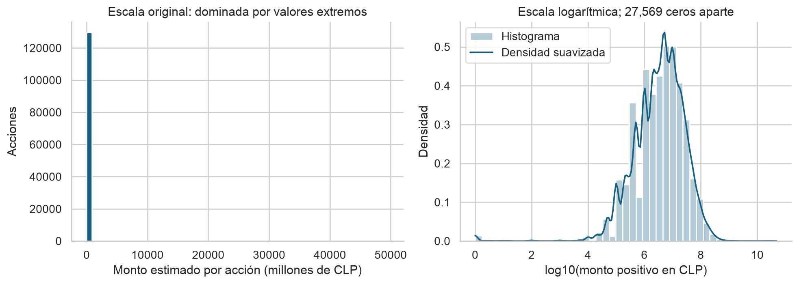
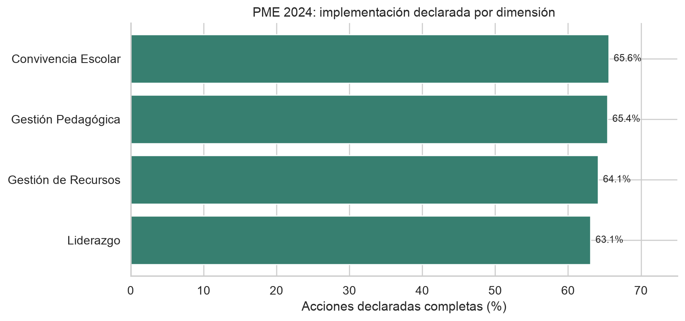
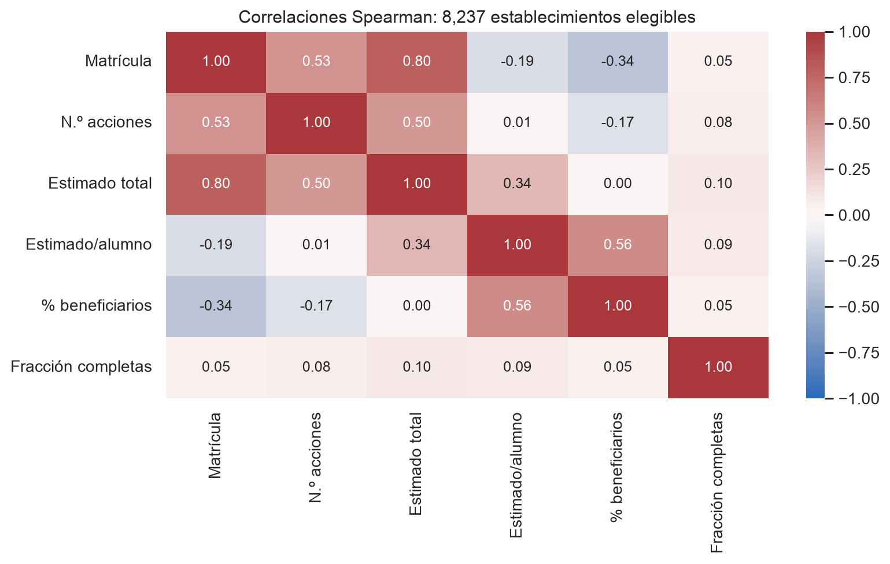
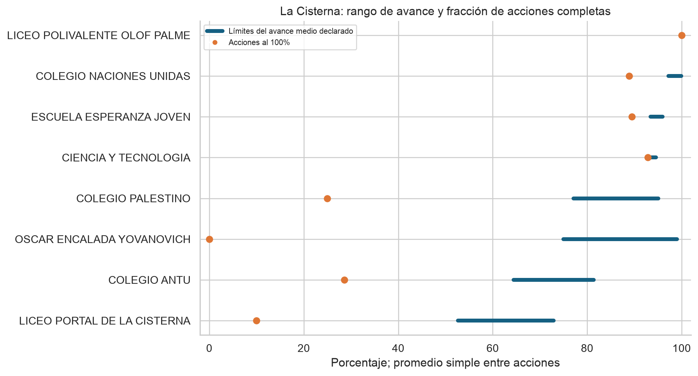
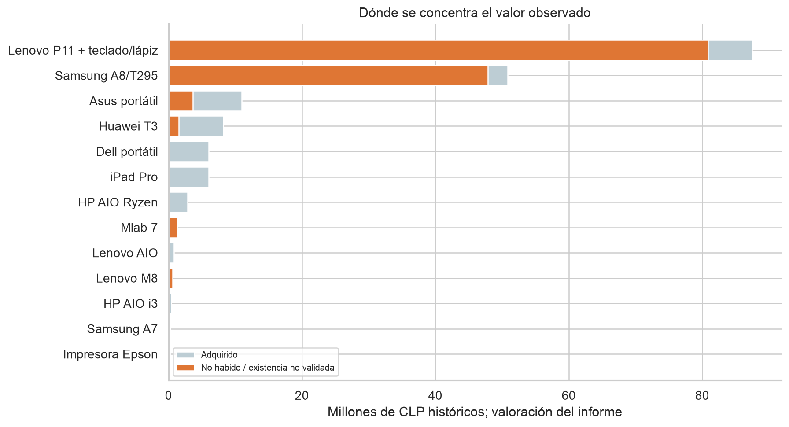
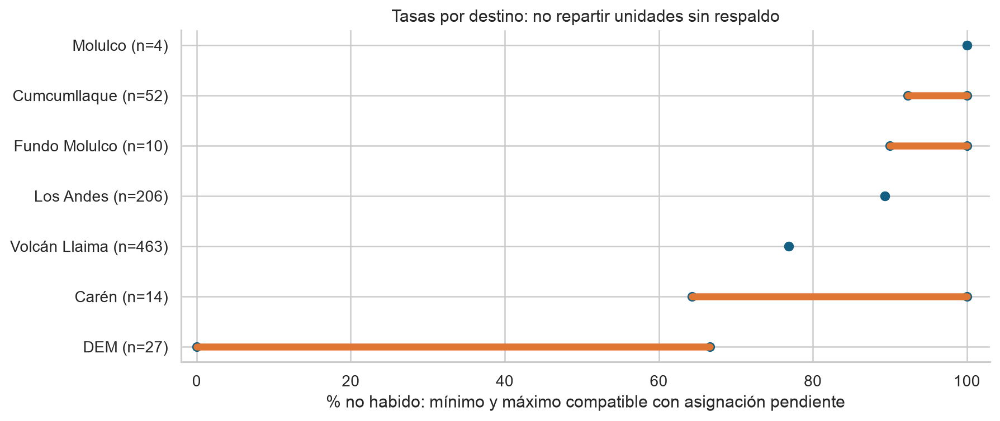

# Del gasto educativo a la disponibilidad de los recursos

**EDA con evidencia pública · Chile · 23 de septiembre de 2026 · marco de evaluación actualizado el 25 de septiembre de 2026**

El análisis encontró un caso documental suficientemente sólido para cambiar el foco desde La Cisterna hacia **Melipeuco**. Contraloría examinó 776 equipos adquiridos por $176.164.029 y observó 628 cuya ubicación o existencia no pudo validar, por **$136.405.378**. Reconstruimos esos resultados desde las tablas originales. Además, al cruzar dos anexos, encontramos **476 equipos con certificado de comodato que también figuran entre los no habidos**. La documentación de entrega y la disponibilidad posterior son controles distintos. [Informe final CGR 43/2024, páginas impresas 1–2, 18–22 y anexos 1, 4 y 5](https://www.ciperchile.cl/wp-content/uploads/FIRMADO_Informe-final-de-investigacion-especial-N%C2%B043_de-2024_DEM_Melipeuco_.pdf).

**La conclusión defendible es una falla histórica de custodia y disponibilidad documentada por el fiscalizador.** El costo de adquisición observado no es automáticamente pérdida definitiva, dinero robado ni valor de mercado actual. Tampoco sabemos, con los documentos recuperados, cuánto se restituyó después. Esta distinción delimita el hallazgo; no lo reduce a una simple sospecha estadística.

## 1. Idea, pregunta y elección de indicadores

La pregunta es: **¿qué proporción de los recursos educativos adquiridos puede seguirse hasta su disponibilidad, y qué indicadores públicos sirven para detectar brechas sin confundir planificación con gasto?** La pregunta evaluativa siguiente es si cada compra pagada fue admisible, pertinente, efectivamente utilizada y razonable en costo. El [marco de evaluación](Marco_evaluacion_gasto.md) fija reglas y evidencia para responderla sin usar SIMCE como sustituto del uso. Interesa porque una compra y su respaldo contable pueden existir sin que el recurso siga disponible para enseñar.

Se investigaron dos niveles complementarios:

- **Contexto nacional 2024:** 129.726 acciones PME de 8.240 establecimientos, vinculadas al directorio oficial. Sirve para examinar distribuciones, comparabilidad y calidad de indicadores.
- **Caso auditado Melipeuco:** compras de 2020–2022, inspección en diciembre de 2023 e informe final de junio de 2024. Sirve para seguir recursos y reconstruir una brecha constatada.

La selección de Melipeuco es **intencional y posterior a encontrar evidencia documental**. No permite decir que sea la peor comuna ni estimar la prevalencia nacional del problema. La Cisterna se mantiene en las bases y en una comparación específica, pero no apareció en lo revisado una prueba equivalente de despilfarro.

| KPI | Definición | Resultado / interpretación |
|---|---|---|
| Brecha física auditada | Equipos no habidos o sin existencia validada / equipos adquiridos del universo CGR | **628/776 = 80,93%**. Describe la fiscalización histórica. |
| Valor de adquisición observado | Valor de esos bienes / valor de adquisición publicado | **$136.405.378/$176.164.029 = 77,43%**. Exposición a costo histórico; no pérdida firme. |
| Comodatos sin localización en el cruce | Series y facturas coincidentes entre anexos 4 y 5 / registros del anexo 5 | **476/600 = 79,33%**. Tener certificado no asegura restitución. |
| Concentración del valor observado | Valor observado de una familia / valor observado total | Las Lenovo P11 reúnen **59,27%** del valor observado. Prioriza revisión. |
| Estimación PME por estudiante | Suma de estimaciones de acciones / matrícula de abril del mismo año | Compara escala de planificación; no financiamiento efectivo por alumno. |
| Implementación declarada | Fracción de acciones al 100% y rango del avance medio | Son dos indicadores diferentes. Ninguno prueba uso ni ejecución financiera. |
| Clasificación de compras pagadas | Partidas por cada categoría / partidas pagadas clasificables; publicar por separado las pendientes | **Aún no calculable** con PME y anexos CGR: faltan pagos y evidencia comparable de uso para el universo. |

No se calcula utilización de licencias, costo por usuario activo, proporción de compras «bien utilizadas» o “gasto no aceptado firme”: faltan sus denominadores, pagos vinculados y resoluciones. Se evita rellenar esa ausencia con cero.

## 2. Datos descargados y preparación

Se conservaron el informe CGR de 91 páginas, su reporte nacional de hallazgos, los directorios oficiales 2021 y 2024, la base de implementación PME 2024 y los catálogos de descarga. Cada archivo tiene URL, fecha, tamaño y SHA-256 en [el manifiesto](../datos/fuentes.json). Las copias de documentos CGR están alojadas por medios de comunicación; los productores de los documentos son los organismos fiscalizadores, y sus totales aparecen también en la publicación oficial indexada.

El PME se eligió en 2024 porque permite una sección transversal completa y consistente con el directorio. **Sus montos son estimaciones declaradas**, incluso en la etapa denominada implementación; Mineduc advierte que no constituyen aprobación ni aceptación del gasto. No es una base de facturas. [Catálogo y advertencia oficial](https://liderazgoeducativo.mineduc.cl/bases-de-datos-pme/).

La limpieza produjo resultados verificables:

| Control | Resultado y decisión |
|---|---|
| Conteos CGR | 29 partidas de compra, 21 combinaciones de documento de pago, 776 equipos; 625 registros del anexo 4 más dos de tabla 3 y uno de tabla 4. |
| Total de adquisiciones | Las partidas suman **$176.164.030**, $1 más que el total impreso. Se conserva la diferencia; no se altera ningún valor. |
| Página compartida | La página PDF 63 contiene el final del anexo 4 y el inicio del 5; se separaron sus tablas. |
| Series ausentes | 144 registros del anexo 4 sin serie identificable. Sus filas representan unidades y no se eliminan por parecer duplicadas. |
| Duplicados PME | Cuatro filas exactamente repetidas adicionales: marcadas, conservadas y analizadas con sensibilidad. No existe ID oficial de acción para resolverlas. |
| Faltantes PME | 38 valores SEP ausentes; permanecen ausentes. No hay montos negativos ni fechas de término anteriores al inicio. |
| Conciliación PME | 86 acciones con diferencia entre total y componentes completos; 57 difieren en más de $1. No se corrigen sin respaldo. |
| Unión escolar | 8.240 de 8.240 RBD encuentran directorio; 8.237 están activos y tienen matrícula positiva para calcular razones y correlaciones. |

Un error especialmente grave habría sido usar `MATRICULA` como número de alumnos: en el directorio es un indicador binario. Se utiliza **`MAT_TOTAL`**. Los dos establecimientos llamados Molulco se distinguen por RBD y por la tabla escolar del informe CGR. [Detalle completo de reglas y diccionario](../datos/DICCIONARIO.md).

## 3. EDA nacional: por qué el promedio puede llevar a una falsa acusación

La estimación por acción tiene **mediana de $2 millones** y **media de $13,21 millones**. Hay 27.569 acciones con monto cero, el 21,25% de las filas: algunas actividades pueden utilizar recursos existentes o declarar su costo en otra acción; cero no equivale a inactividad. Los montos positivos muestran asimetría marcada y acumulaciones en cifras redondas.

La densidad se calcula sobre `log10(monto)` únicamente para valores positivos; el eje representa órdenes de magnitud en pesos. Se usa para describir la forma, no para asumir normalidad ni interpretar cada pico como un grupo institucional. Los ceros se contabilizan aparte.

**Sólo 19 acciones, el 0,015% de las filas, concentran 12,80% del total declarado.** Todas superan $1.000 millones. El máximo es $49.600 millones en una acción. Son cifras que exigen verificación de registro y unidades, no evidencia de transferencias efectivas de ese tamaño.

| Escenario | Acciones | Media por acción | Mediana |
|---|---:|---:|---:|
| Todos los registros | 129.726 | $13.212.308 | $2.000.000 |
| Sensibilidad: acciones de hasta $1.000 millones | 129.707 | $11.523.437 aprox. | $2.000.000 |

El umbral no establece qué registros están equivocados: mide dependencia de las conclusiones respecto de la cola extrema. La base principal conserva todos los montos. Quitar los cuatro duplicados exactos adicionales sólo reduce el total en $200; el problema relevante aquí es la cola, no esos duplicados.

### Implementación declarada por dimensión PME

El workshop W1 añadió una comparación que usa **acciones**, no pagos ni resultados de aprendizaje. En 2024, la mediana estimada por acción y la fracción reportada al 100% fueron:

| Dimensión | Acciones | Mediana estimada por acción | Acciones al 100% |
|---|---:|---:|---:|
| Convivencia Escolar | 31.839 | $1.800.000 | 65,57% |
| Gestión Pedagógica | 39.425 | $2.000.000 | 65,38% |
| Gestión de Recursos | 31.083 | $6.000.000 | 64,10% |
| Liderazgo | 27.379 | $750.000 | 63,07% |

Gestión de Recursos tiene la mayor mediana de estimación, pero eso no prueba mayor gasto efectivo ni mayor eficiencia. Las cuatro dimensiones aparecen entre los 8.240 RBD del extracto; la proporción al 100% es un conteo de acciones, no un porcentaje de avance promedio. Las diferencias entre dimensiones son descriptivas y pequeñas frente a las limitaciones de autorreporte y cobertura. [Datos y decisión comparativa del workshop](../workshop/GROUP_03_W1/report/GROUP_03_W1_Report.pdf).

### Correlaciones y comparabilidad

Se agregaron las acciones por escuela **antes** de correlacionar. De lo contrario, repetir matrícula por cada acción habría dado más peso a establecimientos que registran más actividades.

Entre las 8.237 escuelas elegibles:

- **Matrícula–estimación total:** Spearman **0,796**. El tamaño explica una parte importante del ordenamiento de montos; un total alto no es por sí mismo una señal anómala.
- **La misma relación con Pearson:** **0,160** en la base completa, frente a **0,757** al retirar del cálculo las 16 escuelas con alguna acción >$1.000 millones. Spearman permanece en **0,796**. La discrepancia revela sensibilidad extrema de la correlación lineal a esos valores.
- **Estimación por alumno–porcentaje de beneficiarios SEP:** Spearman **0,565**. Es compatible con diferencias de necesidades y focalización; no prueba que cada peso haya llegado a su destinatario.
- **Estimación por alumno–fracción de acciones completas:** Spearman **0,089**, y **0,088** sin las escuelas con valores extremos. La asociación descriptiva es débil. Al separar dependencia y ruralidad, los coeficientes van aproximadamente de −0,012 a 0,136, sin aparecer una relación fuerte escondida en esa agrupación.

Estas son asociaciones entre declaraciones de planificación e implementación, **no estimaciones de impacto educativo**. No se usan valores p para convertir una base de cobertura seleccionada en una muestra aleatoria, ni se atribuye causalidad a estas correlaciones. Las observaciones y n de cada pareja están en las tablas exportadas.

La cobertura tampoco es homogénea: entre establecimientos activos con matrícula, aparece PME para el **95,51% de los municipales DAEM**, **96,27% de los SLEP** y **64,32% de los particulares subvencionados**. No corresponde generalizar el promedio de esta base a todos los colegios de Chile sin atender esa selección.

### La Cisterna: una prueba contra un KPI engañoso

Se recuperaron los ocho establecimientos públicos del piloto. Los montos PME por estudiante van aproximadamente de **$211.726 a $729.642** en 2024; su diversidad no demuestra un problema de gasto.

El establecimiento Óscar Encalada tiene **0% de acciones al 100%**, pero sus 13 acciones están clasificadas entre **75% y 99% de avance**. Tratarlo como 0% de implementación sería falso. Ciencia y Tecnología tiene 13 de 14 acciones completas y una inicial; Portal La Cisterna tiene acciones en todos los niveles. Los intervalos describen esas diferencias sin inventar un porcentaje exacto dentro de cada tramo.

Este resultado modifica el diseño del tablero: presentar simultáneamente **fracción de acciones completas y límites del avance medio**, y mantenerlos separados del gasto rendido. No se encontró aquí una conexión documental que permita atribuir estos resultados a las compras mencionadas en la investigación inicial.

## 4. Melipeuco: reconstrucción de un problema material

La inspección ocurrió los días 19, 21 y 22 de diciembre de 2023; el informe final se emitió el 10 de junio de 2024. El universo incluye seis escuelas y el DEM. La tabla de financiamiento registra **SEP, SEP de administración central, FAEP y Movámonos**: no todo corresponde a SEP. Las adquisiciones se concentran en 2021: 619 de 776 unidades y $147.757.907 según suma de partidas. Es concentración temporal, no una medición de crecimiento real del gasto. [CGR, páginas impresas 4–7 y anexo 1](https://www.ciperchile.cl/wp-content/uploads/FIRMADO_Informe-final-de-investigacion-especial-N%C2%B043_de-2024_DEM_Melipeuco_.pdf).

### Primero: comprobar que el monto cierra

| Componente del hallazgo | Equipos | Valor bruto consignado |
|---|---:|---:|
| 10.a: no habidos, anexo 4 | 625 | $136.000.454 |
| 10.b: sin identificación suficiente de serie, tabla 3 | 2 | $164.734 |
| 10.c: impresora no habida, tabla 4 | 1 | $240.190 |
| **Total** | **628** | **$136.405.378** |

Las dos unidades de 10.b se mantienen distinguibles: no poder asociar un comodato a una serie es una limitación de validación, no prueba individual de desaparición. Excluirlas deja 626 equipos y $136.240.644: la magnitud del problema no depende de esa clasificación.

El informe también identifica **61 estudiantes que recibieron tablets después de haber recibido el beneficio tecnológico de Junaeb**, por **$12.415.749**. La municipalidad sostuvo que los equipos anteriores no tenían la misma capacidad para clases en línea, pero el fiscalizador indicó que no aportó sustento técnico y mantuvo la observación. **Esos equipos están incluidos en 10.a**: sumarlos a los $136,4 millones duplicaría el monto. No se afirma que toda segunda entrega sea innecesaria; se identifica una decisión cuya justificación no fue acreditada. [CGR, páginas impresas 17–18](https://www.ciperchile.cl/wp-content/uploads/FIRMADO_Informe-final-de-investigacion-especial-N%C2%B043_de-2024_DEM_Melipeuco_.pdf).

### Segundo: identificar dónde está el valor

Las 250 **Lenovo P11 con teclado y lápiz** representan $87.499.808 en adquisiciones, el **49,67%** del total de partidas. Entre ellas hay **231 no habidas (92,4%)**, valoradas por el anexo en $80.849.769: **59,27% del valor observado total**. Revisar su entrega, garantías, bajas y restituciones ofrece más capacidad explicativa que investigar primero cada compra pequeña.

En cambio, los siete portátiles Dell, seis equipos de escritorio y cuatro iPad no figuran entre los no habidos. Esto no acredita uso pedagógico eficaz, pero muestra que el hallazgo **no afecta de la misma manera a todos los productos**. Los histogramas por lote y por unidad incluidos en el cuaderno también cambian sustancialmente: pocos equipos costosos no representan el equipo típico. No se comparan modelos diferentes para acusar sobreprecio.

### Tercero: separar custodia documental y disponibilidad

El anexo 5 contiene 600 registros con certificado de comodato. La unión exacta por **serie normalizada + factura** encuentra **476 coincidencias** con el anexo 4, por $106.512.158. No hay series repetidas dentro de cada uno de esos anexos en la clave utilizada. Es un resultado calculado sobre los documentos, no una nueva auditoría en terreno.

La enseñanza para BI es concreta: un indicador que marque “cumplido” sólo porque existe un acta o comodato puede ocultar una brecha importante de devolución o localización. El siguiente control necesita fecha de última verificación, estado del activo y cierre del préstamo. Las 124 filas del anexo 5 que no coinciden exactamente no se etiquetan automáticamente como equipos bien utilizados.

### Cuarto: no forzar un ranking escolar

Hay **18 equipos por $2.559.690** cuyo destino en el anexo 4 es “Diferentes Establecimientos”. Aunque el anexo 1 tiene una reserva de 18 unidades en el DEM con la misma factura, eso no basta para identificar automáticamente ambos grupos.

Se calculan límites compatibles con la capacidad de cada destino dentro de esa factura. Volcán Llaima tiene 356 casos identificados de 463 unidades (76,89%) y Los Andes 184 de 206 (89,32%). Molulco tiene cuatro de cuatro, pero el pequeño denominador impide tratar ese 100% como el mismo problema de magnitud que una escuela con cientos de equipos. Las franjas de Carén, Cumcumllaque, Fundo Molulco y DEM muestran la incertidumbre de asignación. **Los máximos son marginales: no pueden ocurrir todos simultáneamente.**

### Quinto: someter el hallazgo a explicaciones alternativas

La municipalidad presentó declaraciones de apoderados sobre fallas de hardware y software y el desecho de equipos. Informó bajas de **333** de los 625 bienes del anexo 4 mediante decretos de enero de 2024. Contraloría mantuvo la observación porque no se acreditó la existencia física ni la baja contable y tampoco se justificaron los **292** restantes. La respuesta municipal forma parte del análisis; no se omite. [CGR, página impresa 21](https://www.ciperchile.cl/wp-content/uploads/FIRMADO_Informe-final-de-investigacion-especial-N%C2%B043_de-2024_DEM_Melipeuco_.pdf).

Si después se recuperaron equipos o se justificaron las bajas, deberá actualizarse el saldo del hallazgo. No tenemos esa evidencia posterior. Tampoco se conocen horas de uso durante la pandemia: el caso no permite afirmar que los equipos nunca se utilizaron. Los $136.405.378 son **valor histórico de bienes observados**, no un cálculo de beneficio educativo perdido.

## 5. Otras comunas: qué evidencia sería más directa de un pago inútil

El reporte oficial de hallazgos CGR documenta en **Yumbel $28.350.000 de desembolsos improcedentes por arriendo de buses escolares** durante la suspensión de clases, incluyendo una renovación sin justificación efectiva documentada. Esta referencia se acerca más a la pregunta estricta por un pago sin la prestación convenida que la sola falta de localización de un activo. Se recuperó el resumen institucional, no el informe íntegro 732/2023 ni su seguimiento; por eso queda como caso de profundización, sin mezclar su monto con Melipeuco. [Reporte CGR, página 74](https://mantencion.contraloria.cl/cgr/documents/451102/20062025/Reporte-de-Hallazgos_2024-2025.pdf).

En **Penco**, el mismo reporte describe una compra tecnológica por $26.014.357 para 15 establecimientos, con bienes de 14 todavía bajo custodia central sin distribución; también un servicio de alarmas por $5.836.909 para 13 escuelas, seis de ellas con alarmas inoperativas. El total de ese contrato no equivale al monto atribuible a las seis instalaciones: falta el desglose. No se usa la regla arbitraria de multiplicar por 6/13. [Reporte CGR, página 82; copia descargada](https://media-front.elmostrador.cl/2025/06/Reporte-de-Hallazgos-2024-2025-1.pdf).

Melipeuco sigue siendo el caso principal porque permite **reconstruir filas, conciliar cantidades y cruzar evidencia**. Yumbel es la prioridad siguiente para responder con mayor precisión cuánto se pagó sin recibir la prestación prevista.

## 6. Qué sostiene este EDA y qué falta

La investigación ya supera un EDA simulado: tiene datos originales, limpieza reproducible, histogramas, densidad, correlaciones con sensibilidad, controles de cobertura y un caso auditado cuyo monto se reproduce. Los hallazgos propios más útiles son la coincidencia de 476 comodatos con bienes no habidos, la concentración del valor observado en P11 y la fragilidad de indicadores basados sólo en promedios o acciones al 100%.

No se enlaza SIMCE con las compras: no se dispone de exposición individual o intensidad de uso, cambian cohortes y la compra perseguía facilitar clases remotas. Incorporar un puntaje posterior no cerraría la prueba de custodia. Tampoco se divide el gasto 2021 por la matrícula 2024 para fabricar un “costo por beneficiario”. La matrícula 2024 sólo normaliza las declaraciones PME de ese año.

**Respuesta a la aspiración de encontrar despilfarro irrefutable:** hay una falla de gestión material y documentada, mantenida tras descargos, y un segundo caso con pagos calificados de improcedentes por CGR. Todavía no hay base para llamar pérdida definitiva actual a todo el valor de Melipeuco. Para llegar a ese resultado hace falta el seguimiento de recuperación, bajas, reposición y resoluciones. Los [borradores de solicitudes](Solicitudes_documentales.md) identifican equipos, facturas, decretos y numerales precisos; no se ha enviado ninguna solicitud.

Los CSV, el Excel y el cuaderno permiten revisar todas las cifras. El [diccionario](../datos/DICCIONARIO.md) hace explícitas las decisiones que podrían cambiarlas, y `verificaciones.csv` registra los controles de procedencia y conservación. El proyecto queda preparado para incorporar antecedentes posteriores sin convertir las brechas de información en acusaciones.

## 7. Evaluar «bien invertido» sin exigir causalidad SIMCE

El EDA ya mide una brecha de **custodia y disponibilidad**, no la tasa de inversiones eficaces. Para evaluar una partida pagada se necesitan cuatro controles separados: legalidad y conciliación del fondo; necesidad y objetivo formulados antes de comprar; entrega, funcionamiento y uso durante el período exigible; y costo total comparado con alternativas equivalentes. La [Ley 20.529, artículo 55](https://www.bcn.cl/leychile/navegar?idNorma=1028635) distingue el juicio de legalidad de la rendición del mérito del uso; la [ISSAI 300](https://www.issai.org/pronouncements/issai-300-performance-audit-principles/) distingue economía, eficiencia y eficacia. Así, una rendición aceptada tampoco acredita por sí sola que la inversión haya sido útil.

Las **cuatro categorías propuestas** se conservan: (1) gasto legítimo y bien utilizado, (2) legítimo pero aparentemente ineficiente, (3) difícil de justificar respecto del objetivo declarado y (4) potencialmente irregular o improcedente. Se asignan a la **partida pagada** y a la evidencia disponible, con señales secundarias y fecha de corte. **«Pendiente de clasificación»** protege los casos sin pago/beneficiario/uso comprobados; no se fuerza una categoría para completar el tablero. El criterio detallado, las reglas para contratos mixtos y los KPIs están en el [marco de evaluación](Marco_evaluacion_gasto.md).

El estudio [«Gasto social en la mira», de Gabriel Ugarte (CEP, diciembre de 2025)](https://static.cepchile.cl/uploads/cepchile/2025/11/28-155617_h03g_pder752_Ugarte.pdf) no es una auditoría de licitaciones escolares: estima errores de focalización de prestaciones. Sí ofrece una estrategia útil: confrontar una asignación con un **criterio previo y una fuente independiente**, explicitar supuestos de monetización y mostrar escenarios bajo/alto cuando la clasificación es incierta. Aquí el contraste sería necesidad y beneficiario declarado frente a entrega y uso acreditados, con monto **pagado por ítem**. Sus porcentajes de gasto social no pueden extrapolarse a SEP ni a compras de educación escolar.

**Lectura de los casos actuales:** el hallazgo CGR de Melipeuco es una señal documentada de categoría 4 para la observación de custodia de los 628 equipos, pero el monto es costo histórico observado y el seguimiento posterior permanece desconocido. Los 61 casos de segunda entrega son parte de ese conjunto. El resumen de Yumbel también aporta una señal de categoría 4 limitada a los desembolsos calificados allí; falta el expediente íntegro. Penco prioriza verificar distribución y servicio, sin asignar el precio total de las alarmas a las seis escuelas. Las declaraciones PME 2024 y las compras piloto de La Cisterna siguen **pendientes de clasificación**. Ninguna de estas filas permite calcular todavía la proporción de licitaciones de cada categoría en una población general.

Para SIMCE se requiere que el objetivo de la compra sea aprendizaje medible en un grado y asignatura definidos, en un plazo razonable. Aun entonces, un antes/después sólo describe evolución. Una atribución causal exigiría exposición identificada, línea base, grupo de comparación creíble y prueba de tendencias previas y cambios simultáneos; la [DIPRES](https://www.dipres.gob.cl/598/w3-propertyvalue-24886.html) reserva la evaluación de impacto para diseños experimentales o cuasi experimentales con identificación defendible. En tablets de clases remotas, los indicadores próximos son disponibilidad, acceso y continuidad durante la vigencia, aunque SIMCE no cambie después.

**Decisión para la siguiente fase:** registrar por partida el pago, fondo, destino, objetivo previo, prestación exigible, evidencia de uso, costo comparable, descargos y estado de seguimiento. Publicar (a) cobertura de partidas clasificables, (b) distribución de las cuatro categorías sólo entre esas partidas y (c) montos pendientes, sin extrapolar desde Melipeuco, caso elegido por hallazgo. Los [borradores de solicitudes](Solicitudes_documentales.md) se ampliaron para reunir la evidencia que falta.
